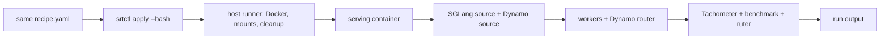

# Direct host lifecycle

Use the direct lifecycle to run one Dynamo + SGLang benchmark on the GPU host you are already logged into. It consumes the same recipe as SLURM; only the execution owner changes.

| Target | Command | Owner |
| --- | --- | --- |
| SLURM cluster | `srtctl apply -f recipe.yaml` | Scheduler, `srun`, and the job container |
| One GPU host | `srtctl apply -f recipe.yaml --bash` | Docker host runner and one serving container |

The direct path is intentionally single-host. It supports the SGLang backend behind the Dynamo frontend, one concrete custom benchmark, optional Mooncake, Tachometer, and ruter. Use the SLURM lifecycle for multi-node runs, sweeps, profiling, or DCGM power telemetry.



## Requirements

- A single GPU host with Docker and the NVIDIA Container Toolkit. The host must be able to run `docker run --gpus all ...`.
- An absolute model path readable by Docker. A Hugging Face snapshot is supported; its repository root is mounted so its `blobs/` symlinks resolve.
- An absolute checkout of the SGLang source to install inside the serving image.
- A serving image configured as `environment.SRTCTL_LOCAL_CONTAINER_IMAGE`.
- `dynamo.hash` or `dynamo.top_of_tree: true`. The first run builds a hash-keyed Dynamo wheel outside the container; later runs reuse it.
- `make setup ARCH=$(uname -m)` for the bundled Tachometer scraper and infrastructure binaries. For ruter, install its optional dependency with `uv sync --extra ruter`.

The direct runner creates a cached SGLang environment under `<output-base>/.srtctl-runtime/` and Dynamo wheels under `<output-base>/.srtctl-cache/dynamo-wheels/`. Delete those only when you deliberately want a cold rebuild.

## Run the included 3P2D route-observability recipe

This recipe uses three TP1 prefills and two TP1 decodes on one eight-GPU host. It runs a Mooncake trace, scrapes Tachometer, and normalizes the ruter bundle.

```bash
cd /path/to/srt-slurm
make setup ARCH="$(uname -m)"
uv sync --extra ruter

export RUTER_MODEL_PATH=/absolute/path/to/Qwen3-32B-FP8
export RUTER_SGLANG_SOURCE=/absolute/path/to/sglang
export RUTER_MOONCAKE_TRACE=/absolute/path/to/mooncake_refined.jsonl

uv run srtctl apply -f recipes/qwen3-32b/ruter-3p2d-dynamo.yaml -o /absolute/path/to/runs --bash > run.sh
bash -n run.sh
bash run.sh
```

`--bash` renders a small host launcher. When it runs, the launcher starts a labeled Docker container, installs the selected SGLang source before plain Dynamo, starts the infrastructure and workers, waits for a smoke request, then runs Tachometer, AIPerf, and ruter. `Ctrl-C` and `SIGTERM` stop only processes and containers owned by this run.

The recipe keeps both `model.container` and `SRTCTL_LOCAL_CONTAINER_IMAGE` so it is also valid for the SLURM lifecycle. The direct lifecycle uses `SRTCTL_LOCAL_CONTAINER_IMAGE`; SLURM uses the normal container setting.

## Inspect the result

Each direct run creates its own timestamped directory below `-o` (or `outputs/` if `-o` is omitted):

```text
<run>/
├── direct-host-plan.json       # host ownership, mounts, and runtime inputs
├── direct-plan.json            # in-container worker/router plan
├── logs/
│   ├── worker-*.log            # one log per prefill/decode worker
│   ├── router.log
│   ├── tachometer.log
│   ├── aiperf.log
│   └── .ruter/
├── artifacts/
│   ├── aiperf/
│   ├── dynamo-request-trace*.jsonl.gz
│   └── tachometer/local/final.parquet
└── tachometer.toml
```

Names vary slightly with the recipe, but workers, router, Tachometer, benchmark, and post-processing never share a log file. Raw logs and Parquet remain unchanged; ruter writes normalized records in `logs/.ruter/`.

Open the route view after the run:

```bash
uv run srtctl view /absolute/path/to/runs/<run>
```

See [ruter](ruter.md) for the normalized bundle and viewer behavior.
